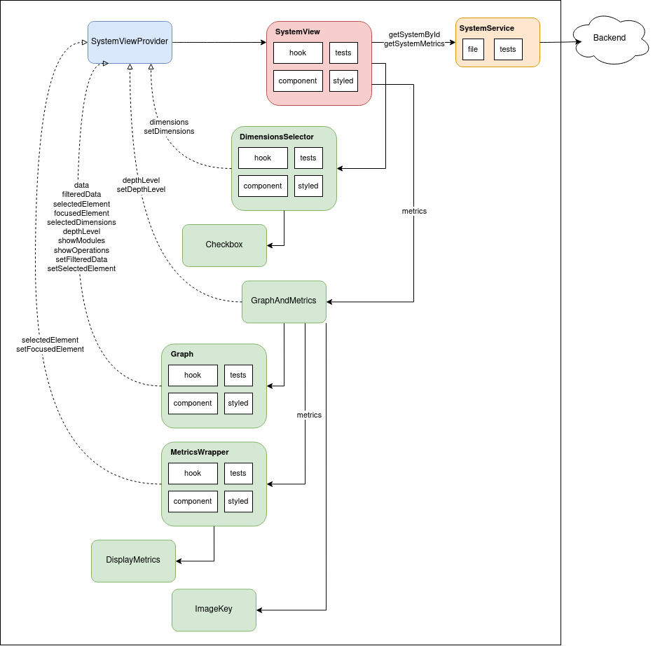
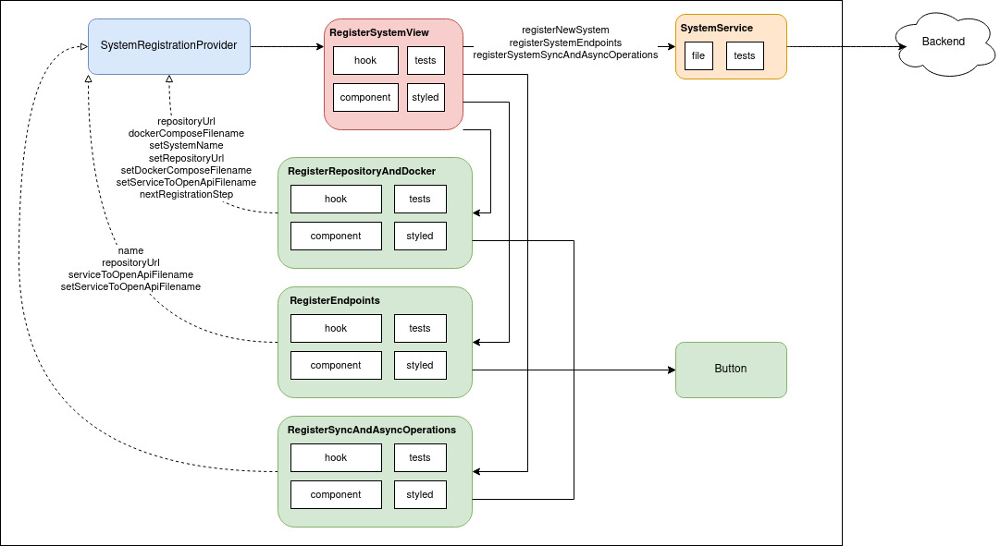
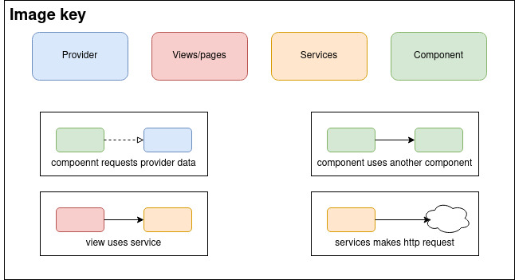

# Sorting Hat - Frontend

Repositório contendo toda a parte de visualização da plataforma Sorting Hat.

## Tecnologias

Durante o desenvolvimento desse projeto, foram utilizadas as seguintes tecnologias:

- [Typescript](https://www.typescriptlang.org/)
- [Next.js](https://nextjs.org/)
- [styled-components](https://styled-components.com/)
- [testing-library/react](https://testing-library.com/docs/react-testing-library/intro/)
- [jest](https://jestjs.io/pt-BR/)
- [React Context API](https://legacy.reactjs.org/docs/context.html)
- [Force-graph library](https://github.com/vasturiano/force-graph)
- [Axios](https://axios-http.com/ptbr/docs/intro)

## Como executar

**Passo 1)** Copie o conteúdo do arquivo `.env.sample` para um arquivo `.env.local`. Coloque o valor da variável de ambiente `NEXT_PUBLIC_BACKEND_URL` para onde está o backend do Sorting Hat.

- Se estiver executando o backend localmente, coloque `ǸEXT_PUBLIC_BACKEND_URL=http://localhost:8080`

- Se preferir usar o backend de produção, coloque `ǸEXT_PUBLIC_BACKEND_URL=http://ec2-3-239-58-239.compute-1.amazonaws.com:8080`

**Passo 2)** Execute o comando a seguir para subir a aplicação:

```shell
npm run dev
```

Caso prefira subir a aplicação com docker-compose, execute o seguinte comando:

```shell
docker-compose up
```

Para executar os testes automatizados da aplicação, execute o seguinte comando:

```shell
npm run test
```

Caso prefira executar os testes com docker, execute o seguinte comando:

```shell
docker-compose run --rm web npm run test
```

## Funcionamento

Ao acessar a página inicial, é possível escolher um sistema da lista disponível para visualizar sua arquitetura. Caso preferir, é possível usar o mecanismo de buscar para buscar por nome ou pela descrição do sistema.

Também é possível registrar um novo sistema clicando no botão "Register new system".

### Visualização de um sistema

Ao clicar em um sistema da lista disponível na página inicial, o usuário é redirecionado para a página de visualização daquele sistema. Nela é possível filtrar a visualização por diversos mecanismos. Um deles são as 4 dimensões.

Se o usuário quiser visualizar as operações dos serviços, deverá marcar a opção "Size"; se o usuário quiser visualizar os usos de bancos de dados por serviços, deverá marcar a opção "Data coupling"; se o usuário quiser visualizar as comunicações síncronas entre serviços, deverá marcar a opção "Synchronous coupling"; se o usuário quiser visualizar as comunicações assíncronas entre serviços, deverá marcar a opção "Asynchronous coupling".

Existem ainda outras opções disponíveis. Caso queira ver quais são as operações que um serviço usa de outro nas comunicações síncronas, o usuário deverá marcar a opção "Link synchronous communications through operations". Caso queira agrupar os serviços por unidades de deploy (serviços que são implantados juntos), o usuário deverá marcar a opção "Group services by deployment unit (Modules)".

É possível ainda clicar em um dos serviços da visualização. Quando isso é feito, o serviço fica destacado na cor amarela e a visualização é filtrada de acordo com a profundidade especificada no input numérico Depth acima do grafo, em que o usuário pode controlar a profundidade das relações com o serviço selecionado até um certo nível.

A visualização conta ainda com uma lista de métricas daquele sistema. As métricas são divididas em globais (aquelas referentes ao sistema como um todo) e específicas (para um único serviço). As métricas específicas ficam disponíveis abaixo das globais quando o usuário clica em um serviço na visualização.

Existem algumas métricas em que o seu valor são nomes de serviços que ficam destacados como links na visualização. Caso esses links sejam clicados, a visualização dá um zoom no serviço que foi clicado.

### Cadastro de um novo sistema

Após clicar no botão "Register new system" na página inicial, o usuário é levado a uma página para cadastrar o sistema. Esse cadastro é dividido em três etapas: (1) cadastro dos serviços, bancos de dados e usos de bancos de dados por serviços, (2) cadastro das operações de cada serviço e (3) cadastro das operações síncronas e assíncronas de cada serviço.

No passo (1), é pedido o link de um repositório do github ou gitlab que contém um arquivo docker-compose descrevendo os containers do sistema que representam serviços e bancos de dados. O caminho até esse arquivo docker-compose também é solicitado. Após o usuário clicar em registrar, a plataforma irá identificar quais são os serviços, bancos de dados e usos de bancos de dados por serviços.

No passo (2), a plataforma traz todos os serviços identificados no passo anterior e pede ao usuário que informe os arquivos open-api que descreve a API de cada serviço. O usuário pode informar o caminho para o arquivo open-api de cada serviço ou pode deixar em branco caso não haja. Após clicar em registar, a plataforma identificará as operações de cada serviço.

No passo (3), é possível selecionar um dos serviços e registrar as operações síncronas e assíncronas que esse serviço performa sobre outros. Para as operações síncronas, é necessário selecionar o outro serviço que ele se comunica e também selecionar qual a operação daquele serviço é utilizada. Já para as operações assíncronas, é necessário selecionar o outro serviço que ele se comunica e digitar qual é o nome do tópico acessado. Após terminar de registrar todas as operações e clicar em Finalizar, o usuário é levado a página de visualização do sistema que acabou de cadastrar.

## Visão geral da arquitetura

### Arquitetura da página de visualização de um sistema



### Arquitetura da página de cadastro de um sistema





## Estrutura de pastas

- `common/`: contém os modelos/interfaces bases de domínio do projeto, como por exemplo as interfaces representando um sistema e suas métricas.
- `components/`: contém todos os componentes que são usados pelas páginas.
- `contexts/`: contém a lógica de acesso e alteração dos estados globais das páginas, i.e. que podem ser obtidos por qualquer componente.
- `pages/`: contém os arquivos que servem de rotas para o Next.js. Cada page tem uma view associada.
- `services/`: contém a lógica associada ao processamento dos dados do grafo de visualização, além de conter também lógica associada a comunicação com o mundo externo, como por exemplo o backend da aplicação.
- `styles/`: contém arquivos de estilos globais para o projeto.
- `views/`: contém os componentes usados pelas pages. Cada page renderiza uma view.

As subpastas de dentro das pastas `components/` e `views/` contém componentes React que seguem a seguinte divisão:

- `hook`: lógica do componente.
- `*.tsx`: dumb component (sem lógica de dados, somente visualização).
- `*.test.tsx`: testes do componente.
- `styled`: arquivo contendo os componentes estilizados com o styled-components e usados pelo componente em questão.

## Para contribuir

- Crie issues reportando problemas e melhorias para a aplicação
- Para resolver uma issue, crie um PR associado a ela. Esse PR só poderá ser mergeado se todos os testes automatizados passarem na pipeline de execução.

## Contribuidores

- [Derick William](https://github.com/DerickWMFrias)
- [Erick Rodrigues](https://github.com/erickrodrigs)
- [Gabriel Henrique](https://github.com/gabrielhpr)
- [Julia Leite](https://github.com/LeiteJu)
